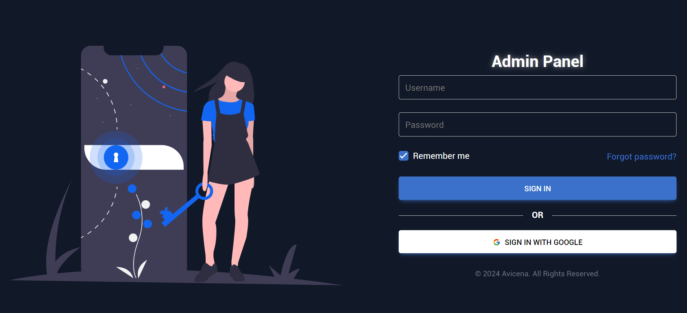

<h1 align="center">Fancy to see you here  </h1>

Hi, I'm Muhammad Avicena. In this repo, I have built a BookList Skyworx using React-Vite, TailwindCSS, TW Elements React, and Vercel Deployment. I have implemented clean code and followed best practices to ensure a high-quality solution. If you have any questions or feedback, feel free to reach out to me at any time!

I am committed to staying up-to-date with industry trends and using the latest tools to develop innovative solutions that surpass expectations.
Interested to have collaboration ? Find me on:

[](https://www.linkedin.com/in/muhammad-avicena/)
[](https://www.youtube.com/@MuhammadAvicena)
[](https://www.instagram.com/ryuhideaki.dev/)
[](mailto:cenarahmant.dev@gmail.com)

## INGREDIENTS I USE 📜

- WebClient (Web)
  - JavaScript
  - Vite-React
  - Tailwind CSS
  - TW Elements React

## HOW TO SET UP 📰

You will need a github account to clone this repository, make sure you're connected to github.

```bash
# Clone this repository or simply fork it.

- git clone https://github.com/muhammad-avicena/book-test-skyworx.git

# Install depedencies

- pnpm install

# Run the application

- pnpm run dev
```

```js
// Dummy Data User

{
    "username": "admin",
    "password": "admin"
}
```

## DEPLOYMENT APP IN VERCEL⚙️

The project has been successfully deployed using Vercel. You can access the production version of the website by following this link: [https://book-skyworx.avicena.dev](https://book-skyworx.avicena.dev).

Feel free to explore the website and try out the different features. I appreciate any feedback and suggestions to further improve the user experience.
